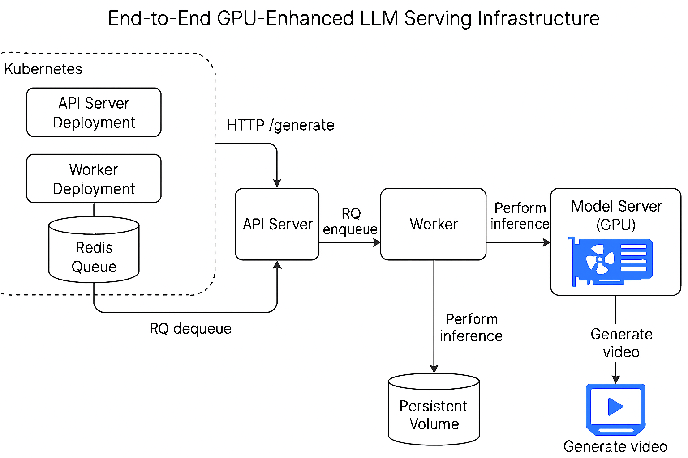

# Scalable Video Generation Platform with Multi-GPU Inference on Kubernetes

## Overview

This project was developed as a hands-on infrastructure engineering exercise focused on building a scalable, GPU-aware video generation system using state-of-the-art diffusion models.

It demonstrates an end-to-end deployment of a text-to-video GenAI workflow using Kubernetes, FastAPI, and Redis-backed asynchronous queues, optimized to fully utilize multi-GPU nodes with concurrent request handling and model-level load balancing.

The architecture is designed to mimic real-world ML inference serving platforms, enabling rapid video synthesis, monitoring, and download through a simple web UI.

---

## Architecture



* **Web UI / Curl Client**: Submits prompts to the API Server.
* **API Server (FastAPI)**:

  * Accepts video generation requests.
  * Stores job metadata.
  * Enqueues jobs to Redis (RQ).
  * Exposes job status and video download endpoints.
* **Redis**: Acts as an async job queue and metadata store.
* **Worker (RQ)**:

  * Polls Redis for queued jobs.
  * Calls the Model Server for inference.
  * Updates Redis with job results.
* **Model Server**:

  * Loads the Mochi model onto all 8 GPUs during startup.
  * Uses GPU-aware locking to manage concurrent inference.
  * Saves generated video to shared PVC.

---

## Component Breakdown

### 1. API Server (`api-server/`)

* FastAPI-based server
* Routes:

  * `POST /generate`: Submit prompt
  * `GET /status/{job_id}`: Job status
  * `GET /download/{job_id}`: Download video
  * `GET /jobs`: View all jobs

### 2. Worker (`worker/`)

* Python RQ worker that pulls jobs from Redis
* Calls `model-server` endpoint with prompt
* Tracks status via Redis `HSET`

### 3. Model Server (`model-server/`)

* Loads DiffusionPipeline on each GPU
* Implements locking using `threading.Lock` to control GPU usage
* Receives `POST /submit` with prompt
* Returns generated video path

---

## Concurrency and GPU Utilization

* Each model-server replica loads the pipeline across available GPUs on startup
* Locks are used to prevent multiple concurrent jobs on the same GPU
* Inference requests are distributed among available GPUs
* Each replica is configured to request 2 GPUs
* With 4 replicas and 8 H100s, full parallelism is possible in ideal routing scenarios

---

## Deployment

### Prerequisites

* Kubernetes cluster with 8×H100 GPUs
* PersistentVolume (PVC) mounted for `/scratch` and `/app/mochi-1-preview`

### Applying the manifests

```bash
kubectl apply -f manifests/redis-deployment.yaml
kubectl apply -f manifests/model-server.yaml
kubectl apply -f manifests/api-server.yaml
kubectl apply -f manifests/worker.yaml
```

---

## Limitations and Learnings

* Due to Kubernetes' service-level routing, jobs were routed unevenly across replicas
* Despite loading all 8 GPUs, only 2 replicas consistently handled inference due to request-level routing behavior
* Redis `hset` was preferred over in-memory dicts to persist job status across API/worker restarts

---

## Future Work

* Implement load-balancing logic or routing to target underutilized pods
* Add retry/backoff queue handling for failed jobs
* Support streaming logs or progress UI
* Better queue monitoring

---

## Testing Concurrency

Use this script to send 8 simultaneous requests:

```bash
#!/bin/bash
for i in {1..8}
do
  curl -X POST http://localhost:8000/generate \
    -H "Content-Type: application/json" \
    -d "{\"text\": \"A cinematic shot of a futuristic city at night\"}" &
done
wait
```

Monitor GPU usage via `nvidia-smi` to confirm distribution.

---

## Contact

Created by \[Devanshu Dighe]. This project was developed as an infrastructure exercise to host and serve LLM related workflows using Kubernetes.
